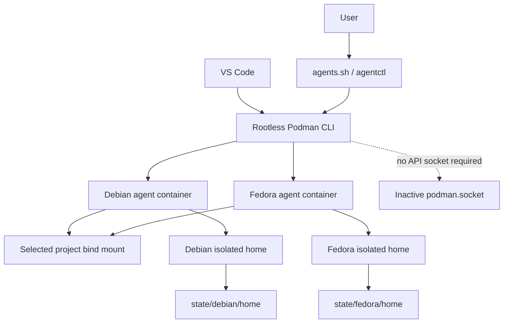
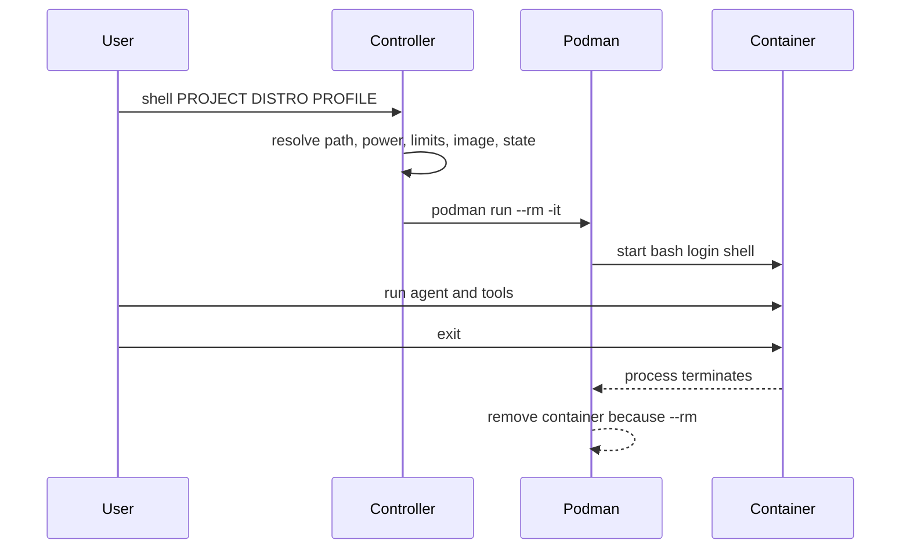

# Technical and Architectural Report

**Report date:** 2026-07-12  
**Architecture status:** Implemented template  
**Target host:** Lenovo ThinkBook 14 G7 ARP / Ubuntu 24.04

## 1. Executive summary

ContainersAgents is a local, manual controller for running autonomous coding agents inside rootless Podman containers. Its primary architectural requirement is that the environment must not create a persistent battery-consuming service: no container, API socket, or user service is required until the user explicitly starts a session.

The system supports two CLI-only Linux profiles:

- Debian 13 Trixie with Node.js 24 LTS as the default agent environment.
- Fedora Minimal 44 as an alternate current-toolchain environment.

The design is optimized for the reported Lenovo ThinkBook 14 G7 ARP with a Ryzen 7 7735HS, 32 GiB of memory, NVMe storage, Ubuntu 24.04, GNOME/Wayland, and a modern Linux kernel.

## 2. Architectural objectives

### 2.1 Functional objectives

1. Run terminal-oriented coding agents in an isolated Linux userland.
2. Support direct CLI sessions and VS Code Dev Containers.
3. Make Debian and Fedora selectable per project/session.
4. Persist agent configuration without mounting the real host home directory.
5. Preserve normal host file ownership on project bind mounts.
6. Provide deterministic start, stop, status, and shutdown-verification commands.

### 2.2 Non-functional objectives

1. No always-on container daemon.
2. No automatic container restart.
3. Minimal inactive battery cost.
4. Bounded CPU, memory, shared-memory, and process consumption.
5. Small and auditable controller surface.
6. No GUI stack in either image.
7. No engine socket exposure to autonomous agents.
8. No destructive global cleanup as routine maintenance.

## 3. System context



## 4. Component model

### 4.1 `agents.sh`

A stable convenience entry point. It resolves the repository directory and delegates all arguments to `agentctl`.

### 4.2 `agentctl`

The lifecycle controller. Its responsibilities are:

- Distribution selection.
- Image construction.
- Battery/AC detection.
- Resource-policy selection.
- Project path normalization and stable project IDs.
- Container naming and labeling.
- Mount construction.
- Container lifecycle operations.
- VS Code configuration generation.
- Background-service disabling.
- Full off-state verification.

It is intentionally a Bash program so it can be audited without a language runtime or dependency installation.

### 4.3 Rootless Podman

Podman is invoked directly for each command. This architecture does not require a long-running daemon or API service. The controller actively disables `podman.socket`, stops `podman.service`, and disables user lingering when requested.

Rootless operation is retained because the small performance difference of rootful execution does not justify allowing a container escape to become host-root access.

### 4.4 Image profiles

#### Debian

- File: `Containerfile.debian`
- Local image: `localhost/containers-agents:debian-node24`
- Base: `docker.io/library/node:24-trixie-slim`
- Container user: `node`
- Container home: `/home/node`

#### Fedora

- File: `Containerfile.fedora`
- Local image: `localhost/containers-agents:fedora44`
- Base: `registry.fedoraproject.org/fedora-minimal:44`
- Container user: `node`
- Container home: `/home/node`

Both images map the `node` user's UID/GID to the user who builds the image. This preserves ownership on the bind-mounted project.

### 4.5 Persistent state

```text
state/debian/home
state/fedora/home
```

Only the chosen distribution's state directory is mounted at `/home/node`. Each contains tool configuration, login state, caches, user-installed npm tools, and user-installed Python packages.

Separate homes are an architectural requirement rather than a cosmetic choice. Native binaries and virtual environments must not be assumed portable across distributions.

### 4.6 Project workspace

The chosen absolute project path is mounted read-write at:

```text
/workspace
```

The agent can modify or delete anything in that project. Containerization protects unrelated host paths; it does not protect the mounted project from the agent.

## 5. Runtime lifecycle

### 5.1 Foreground disposable mode



This is the preferred lowest-overhead mode. No sleeping container remains after shell exit.

### 5.2 Detached mode

`up` starts one named container whose primary process is `sleep infinity`. The process itself is nearly idle, but the environment is still considered active and `off-check` will fail. `exec` enters the running container. `down` stops and removes it.

Detached mode exists for terminal reconnection, not for default use.

### 5.3 VS Code mode

`init-vscode` generates `.devcontainer/devcontainer.json` with:

- The selected image.
- Distribution-specific home mount.
- Resource limits resolved at generation time.
- Project and distribution labels.
- `shutdownAction: stopContainer`.
- File watcher exclusions.

VS Code calls the Podman CLI directly. Closing the associated window stops the container, after which `down` removes it and `off-check` verifies the machine's state.

## 6. Resource policy

| Profile | CPU quota | Memory limit | `/dev/shm` | Intended use |
|---|---:|---:|---:|---|
| Battery | 4 CPUs | 10 GiB | 512 MiB | Mobile use and lower sustained power |
| Balanced | 8 CPUs | 16 GiB | 1 GiB | Moderate parallel workloads |
| AC | 12 CPUs | 22 GiB | 1 GiB | High-throughput agent work while plugged in |

`auto` reads `/sys/class/power_supply`. A system with no detected battery is treated as AC powered.

These limits are ceilings, not reservations. A container does not consume the full memory limit simply because the limit exists. CPU quota matters most for battery use because it caps parallel compute pressure.

Environment variables can override the selected ceiling:

```bash
CONTAINERS_AGENTS_CPUS=6 \
CONTAINERS_AGENTS_MEMORY=12g \
CONTAINERS_AGENTS_SHM=768m \
./agents.sh shell /path/to/project debian battery
```

## 7. Security architecture

### 7.1 Trust boundaries

The container may access:

- The selected project, read-write.
- Its selected isolated home, read-write.
- Its own ephemeral root filesystem.
- The network through Podman's normal rootless networking.

The container is not given:

- The full host home directory.
- `/home/jose` as a broad mount.
- The Podman or Docker socket.
- Host root privileges.
- Automatic restart behavior.
- A GPU device.
- Host SSH agent forwarding by default.

### 7.2 Runtime controls

- Rootless user namespace.
- `--userns=keep-id` for predictable ownership.
- Non-root container user.
- `no-new-privileges`.
- PID limit.
- CPU limit.
- Memory limit.
- Shared-memory limit.
- `restart=no`.
- Podman init process for signal and child-process handling.
- Managed/project/distribution labels for lifecycle enforcement.

### 7.3 Engine-socket prohibition

Mounting the Podman socket into an agent would give that agent control over the user's container engine. It could create new containers and mount arbitrary user-readable host paths. The architecture therefore excludes engine sockets from all mounts.

### 7.4 Credential model

Credentials stored by a CLI are isolated to one distribution's state directory. They are accessible to every process inside that distribution's agent container. This is necessary for the agent to use them and should be treated as part of the trust decision.

Do not bake API keys into a Containerfile, image layer, source repository, or generated Dev Container configuration.

### 7.5 Explicit limitations

A Linux container is not a virtual machine security boundary. An autonomous agent can:

- Damage the mounted project.
- Read any credential mounted into its isolated home.
- Transmit mounted data over the network.
- Consume resources up to its configured limits.
- Install malicious packages in its persistent home.

Use Git, remote backups, branch protection, and least-privilege API credentials.

## 8. Concurrency control

Each project path is hashed into a stable project ID. Every managed runtime receives that ID as a label.

Before starting a CLI or VS Code session, the controller checks for a running managed container with the same project ID. It refuses a second runtime for that project. This prevents Debian and Fedora agents from concurrently editing the same workspace.

Unmanaged Podman commands can bypass this protection; `off-check` therefore checks all running Podman containers, not only managed ones.

## 9. Power and background behavior

### 9.1 Inactive state

When containers are stopped and the API socket/service is inactive:

- Images consume disk only.
- There is no agent CPU activity.
- There is no reserved container memory.
- There is no Podman API daemon polling in the background.

Rootless Podman may retain a namespace pause process so it can preserve user namespaces across invocations. This is distinct from an application container and from the socket-activated API service. The optional `deep-off` command stops it only after the normal off-state invariant passes.

### 9.2 Active state

Power use is dominated by:

1. Agent model/network activity outside the container service itself.
2. Local compilation, tests, indexing, and file watching.
3. CPU parallelism.
4. VS Code extensions and language servers.

The battery profile and watcher exclusions address the largest controllable local contributors.

### 9.3 Off-state invariant

`off-check` succeeds only when:

1. No managed rootless container is running.
2. No other rootless Podman container is running.
3. The user `podman.socket` and `podman.service` are inactive.
4. The user `podman.socket` is not enabled.
5. Rootful system Podman socket/service units are inactive and the system socket is not enabled.
6. User lingering is explicitly reported as disabled.

Stopped images and stopped containers do not cause failure; stopped managed containers can be removed with `down`.

`deep-off` is a second-level operation. It calls `off-check`, then invokes `podman system migrate` as the final Podman operation to stop the rootless namespace pause process. Running any later Podman command may create the pause process again.

## 10. Storage architecture

The images, writable container layers, and metadata live in the user's rootless Podman storage. Project files remain on the host filesystem and are not copied into image layers.

Do not use blanket cleanup as routine maintenance. Inspect first:

```bash
podman system df
podman ps -a
podman image ls
podman volume ls
```

Remove known managed resources through `agentctl` or explicit image names.

## 11. Update architecture

Updates are user-triggered:

1. Run `build debian`, `build fedora`, or `build all`.
2. Podman refreshes the base image because the build uses `--pull=always`.
3. Distribution packages are installed from current repositories during build.
4. Existing containers are not modified in place.
5. New containers use the rebuilt image.
6. Run `image-info` to record effective versions.

Agent CLIs installed under the isolated home are not automatically upgraded by rebuilding the base image. Upgrade them using their official package-manager instructions from inside the relevant distribution.

## 12. Architectural decisions

### ADR-001: Rootless Podman instead of rootful Podman

**Decision:** rootless only.

**Reason:** performance is sufficient on the target host, while rootless operation materially reduces the impact of a container escape.

### ADR-002: No Podman API socket

**Decision:** direct CLI calls.

**Reason:** avoids a persistent activation unit and prevents socket exposure from becoming an agent escape path.

### ADR-003: Debian default plus Fedora secondary

**Decision:** maintain two images.

**Reason:** Debian maximizes agent compatibility and stability; Fedora supplies a second modern userland for portability and RPM validation. Stopped images have no runtime power cost.

### ADR-004: Separate state per distribution

**Decision:** do not share `/home/node` between Debian and Fedora.

**Reason:** avoids native binary, venv, and cache incompatibility.

### ADR-005: Foreground disposable mode as normal operation

**Decision:** recommend `shell` over `up`.

**Reason:** process lifetime is naturally tied to the terminal and the container is removed on exit.

### ADR-006: No `:delegated` bind-mount option

**Decision:** plain Linux bind mounts.

**Reason:** Docker Desktop consistency flags are not a Linux performance requirement and make the design less portable and less clear.

### ADR-007: No global destructive cleanup

**Decision:** no automatic `system reset` or blanket volume prune.

**Reason:** those commands can remove unrelated images, volumes, caches, and credentials.

## 13. Validation strategy

The repository is statically validated with:

```bash
bash -n agentctl
bash -n agents.sh
python3 -m json.tool templates/devcontainer.json
```

After installation on the host, validate runtime behavior with:

```bash
./agents.sh doctor
./agents.sh build all
./agents.sh image-info all
./agents.sh shell /tmp/test-project debian battery
./agents.sh shell /tmp/test-project fedora battery
./agents.sh down --all
./agents.sh off-check
./agents.sh deep-off   # optional; must be the final Podman operation
```

## 14. Source references

- Podman system service: <https://docs.podman.io/en/latest/markdown/podman-system-service.1.html>
- Podman system migrate: <https://docs.podman.io/en/latest/markdown/podman-system-migrate.1.html>
- Podman run: <https://docs.podman.io/en/latest/markdown/podman-run.1.html>
- Podman system reset: <https://docs.podman.io/en/latest/markdown/podman-system-reset.1.html>
- Podman system prune: <https://docs.podman.io/en/latest/markdown/podman-system-prune.1.html>
- Dev Container JSON reference: <https://containers.dev/implementors/json_reference/>
- VS Code alternative container engines: <https://code.visualstudio.com/remote/advancedcontainers/docker-options>
- Debian releases: <https://www.debian.org/releases/>
- Official Node image: <https://hub.docker.com/_/node>
- Fedora Linux 44 announcement: <https://fedoramagazine.org/announcing-fedora-linux-44/>
